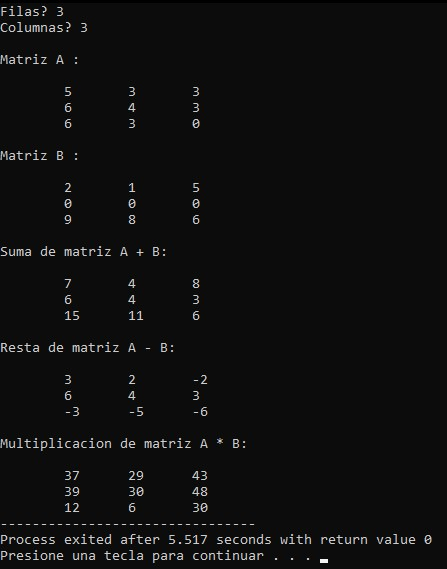

# Matrix Operations

A console-based application that performs basic matrix operations using dynamically allocated two-dimensional arrays.

## Overview

This project allows the user to define the dimensions of two matrices, which are automatically filled with random integer values.

The program performs the following operations:

- Matrix addition
- Matrix subtraction
- Matrix multiplication

The resulting matrices are displayed in the console after each operation.

## Features

- Dynamic matrix allocation.
- Random matrix generation.
- Matrix addition.
- Matrix subtraction.
- Matrix multiplication.
- Console-based interface.

## Screenshot



## Technologies

- C
- Standard C Library
- Dev-C++

## Project Structure

```text
.
├── assets
│   └── images
│       └── matrix_operations_demo.jpg
├── matrix_operations.cpp
├── README.md
├── LICENSE
└── .gitignore
```

## How to Compile

Using GCC:

```bash
g++ matrix_operations.cpp -o matrix_operations
```

## How to Run

Windows

```bash
matrix_operations.exe
```

Linux/macOS

```bash
./matrix_operations
```

## Concepts Demonstrated

- Dynamic memory allocation
- Two-dimensional arrays
- Matrix arithmetic
- Nested loops
- Random number generation
- Pointer manipulation

## Future Improvements

- Validate matrix dimensions for multiplication.
- Allow manual matrix input.
- Support floating-point matrices.
- Implement matrix transpose and determinant calculations.
- Release dynamically allocated memory using `free()`.

## License

This project is licensed under the MIT License.

## Author

Luis Alva
